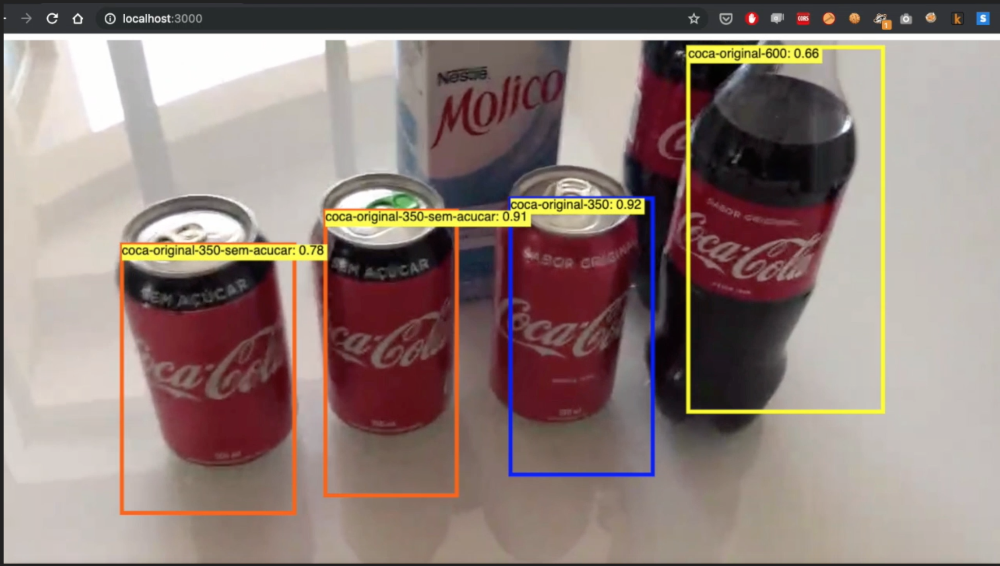

# shelf_object_recognition
SSD generated model capable of identifying 5 distinct micro categories of sodas

This app main purpose is testing if the generated model is capable of identifying this 5 classes, `["coca-original-350-sem-acucar", "coca-original-600", "coca-original-310", "campo-largo", "coca-original-350"]` in a video recorded in a context containing shelf products (e.g., supermarkets, convenienve stores, etc.).

## Prerequisite
--- 
- Node >= 8.x
- NPM >= 6.x

## Project structure 
--- 
 
- public/model_web: Contains the trained model

- public/video: Contains the video that will be used for testing the model.

## Run the project 
--- 

First install the packages needed:

`$ npm i`

Command to start the application :

`$ npm start`

Then and access it under http://localhost:3000

## Test it with your own video 
--- 

- First install ffmpeg package on your machine ([Quick tutorial](https://github.com/adaptlearning/adapt_authoring/wiki/Installing-FFmpeg))

- Run the convert.sh script passing the video you want to convert to HLS (m3u8) type

    `$ ./convert.sh <VIDEO_PATH>`

- Place the generated files in the folder `public/video`

---
Credits to [@bourdakos1](https://github.com/bourdakos1) that created the base script for this web video stream app.